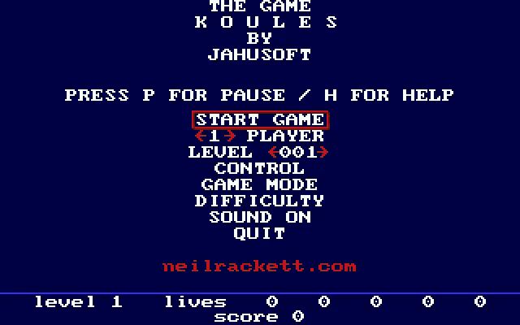

# Koules for Atari ST



Ported to Atari ST by [Neil Rackett](https://neilrackett.com/atarist).

## Push them out before they push you

Koules is a fast, frictionless arcade game: you are a rocket in a box full of
red spheres, and everything bounces. Push the koules into the walls before
they push you, and try not to be shoved into a black hole while you do it.

Written by Jan Hubicka in 1995 for Linux and SVGAlib, it never appeared on the
Atari ST. This is a native port built on
[STDL](https://github.com/neilrackett/atarist-stdl), drawing in ST interleaved
planar with no chunky backbuffer and no c2p pass anywhere.

The game logic, level generator and physics model are upstream's. What the
port replaces is the arithmetic - the simulation was float, which on an FPU-less
68000 ran 18-45x over its frame budget, and is now 16.16 fixed point - along
with the palette (256 colours to 16) and the compositor (a full repaint every
frame to dirty rectangles).

## Controls

| Key            | Joystick | Action                        |
| -------------- | -------- | ----------------------------- |
| ↑ ↓ ← →        | ↑ ↓ ← →  | Thrust (player 1)             |
| W A S D        |          | Thrust (player 2)             |
| I J K L        |          | Thrust (player 3)             |
| Keypad 8 4 5 6 |          | Thrust (player 4)             |
| Return         | Fire     | Select menu item              |
| Esc            |          | Back to menu / quit           |
| H              |          | Help                          |
| P              |          | Pause                         |
| F              |          | Toggle the frame-timing panel |

The joystick in port 1 drives player one and the menus. Keys are rebindable
from CONTROL on the main menu and are remembered between sessions.

## System requirements

- Atari ST, STE or Mega STE, 512KB minimum
- TOS or EmuTOS
- 1MB gets pre-shifted sprites, which make unaligned blits free; on 512KB the
  game detects the shortfall and falls back to plain sprites automatically
- Sound effects play through the STE's DMA hardware where there is both an STE
  and the RAM to hold the samples, and on the YM2149 everywhere else

## Building

STDL is a submodule, so clone with it:

```
git clone --recurse-submodules https://github.com/neilrackett/atarist-koules.git
```

In a clone that already exists, `git submodule update --init` fetches it. Then
cross-compile with `m68k-atari-mint-gcc` via
[atarist-toolkit-docker](https://github.com/sidecartridge/atarist-toolkit-docker)

- the library is built from the submodule as part of it:

```
stcmd make
```

That produces `dist/KOULES.TOS` and the converted sound assets, and `dist/`
doubles as a Hatari GEMDOS drive:

```
hatari --machine st dist/KOULES.TOS
```

`make help` lists the other targets. See
[stdl/README.md](stdl/README.md) for how the port works, and `README` for
upstream's original documentation.

## To do

- Network play. Upstream's client/server code is on the `lr-sdl` branch and
  could come back over [STinG](http://sting.atari.org/), though on a shared
  single screen the 16-colour budget still caps the number of players you can
  tell apart
- Five players on one keyboard, which needs around 24 distinguishable hues
- The Star Wars intro scroller, whose vector font renders glyphs as lines and
  arcs with trigonometry per frame. The briefings appear as paged text instead

## Original Koules

Copyright (C) 1995-1998 Jan Hubicka and Kamil Toman, under the
[GNU General Public License version 2 or later](https://www.gnu.org/licenses/old-licenses/gpl-2.0.html);
see `COPYING`. The Atari ST changes are under the same terms.

This port is (C) 2026 Neil Rackett, based on [lkundrak/koules](https://github.com/lkundrak/koules),
whose `lr-sdl` branch carries the pristine tree and the X11, SVGAlib, SDL,
HP-UX and OS/2 backends that are not built here.
